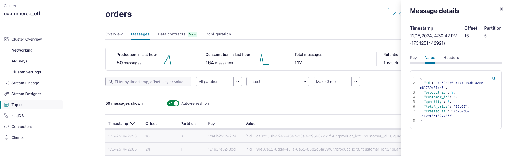

## 2024-12-15

### Generate fake (but realistic-looking) data to stream into Kafka

- I chose not to use Confluent datagen as the [Avro schema examples](https://github.com/confluentinc/kafka-connect-datagen/tree/master/src/main/resources) look quite restrictive (e.g. limited to Regex parsing, and a pre-defined list of `options`) and do not produce realistic-looking data
- Instead, I chose to use [datagen](https://github.com/MaterializeInc/datagen) which leverages on the [faker.js](https://fakerjs.dev/) library

- Download and install [datagen](https://github.com/MaterializeInc/datagen)
```bash
git clone https://github.com/MaterializeInc/datagen.git
cd datagen
npm install
npm run build
npm link

# add to /.bash_profile
export PATH=$PATH:/usr/local/Cellar/node/23.3.0/bin
source ~/.bash_profile # or your equivalent .bash_config file
```

- Verify the installation
```bash
datagen -h
```

- Define products, customers and orders schema in `datagen/ecommerce_data_generator.json`. The default configuration will generate
  - 10 products
  - 3 customers
  - 5 orders per product with randomly-assigned `customer_id`
  - 4 orders per customer with randomy-assigned `product_id`

- Perform a dry run to inspect the fake data that will be generated
```bash
datagen \
    --schema datagen/ecommerce_bootstrapped_data.json \
    --format json \
    --number 1 \
    --dry-run \
    --debug
```

- Create a Kafka cluster in Confluent Cloud and generate an API key.
- Clone `.env.example` into `.env` and fill in the Kafka cluster credentials
- Run the `datagen` generator to produce bootstrapped data into Kafka cluster
  - You only need to do this once to seed the initial set of products and customers
```bash
datagen \
    --schema datagen/ecommerce_bootstrapped_data.json \
    --format json \
    --number 1
```

- Subsequently, to generate more orders, run the `datagen` generator on the orders template. This can be run at a periodic interval
```bash
datagen \
    --schema datagen/ecommerce_orders.json \
    --format json \
    --number 50
```


