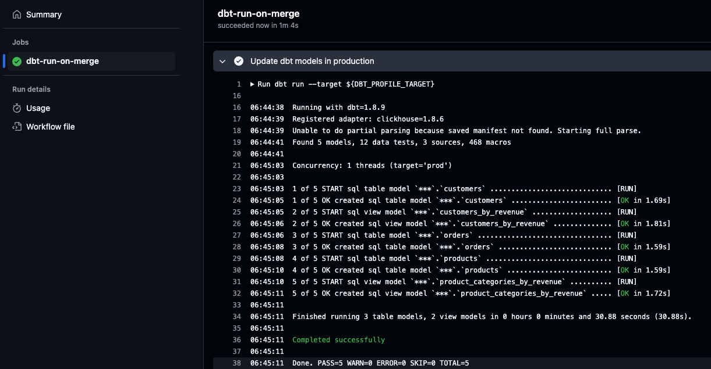
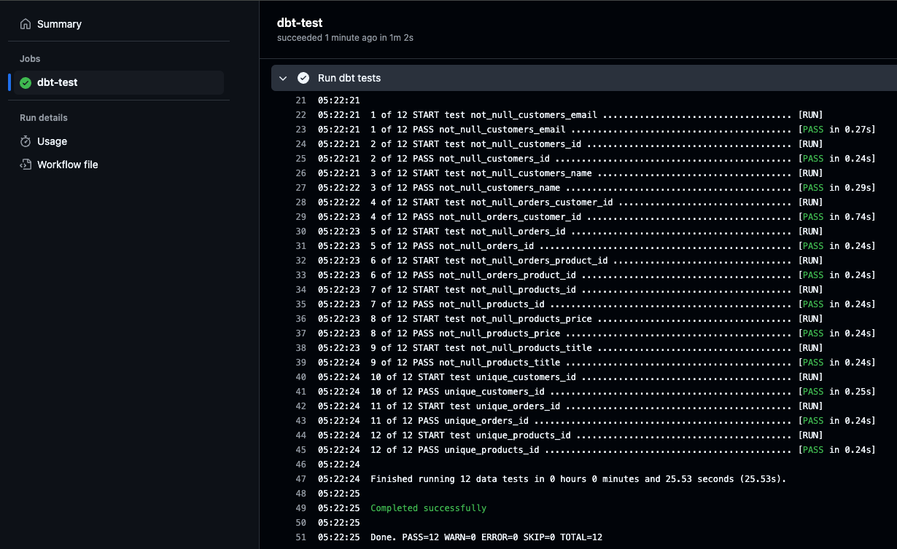

## 2024-12-22

- Add fact and dimension tables
  - Use `surrogate keys` to provide consumers of the dimensional model with an easy-to-use key to join the fact and dimension tables together, without needing to understand the underlying business context

- [dbt_date](https://hub.getdbt.com/calogica/dbt_date/latest/) does not support ClickHouse


## 2024-12-21

- Configure Continuous Deployment using GitHub Actions
  - on merge to `main`, call GH workflow `dbt-run-on-merge` to deploy to production ClickHouse tables
  - [Reference](https://dbtips.substack.com/p/run-dbt-with-github-actions)



-----------

- Add data quality tests

```bash
# 1 of 12 START test not_null_customers_email .................................... [RUN]
# 1 of 12 PASS not_null_customers_email .......................................... [PASS in 0.21s]
# 2 of 12 START test not_null_customers_id ....................................... [RUN]
# 2 of 12 PASS not_null_customers_id ............................................. [PASS in 0.09s]
# 3 of 12 START test not_null_customers_name ..................................... [RUN]
# 3 of 12 PASS not_null_customers_name ........................................... [PASS in 0.03s]
# 4 of 12 START test not_null_orders_customer_id ................................. [RUN]
# 4 of 12 PASS not_null_orders_customer_id ....................................... [PASS in 0.02s]
# 5 of 12 START test not_null_orders_id .......................................... [RUN]
# 5 of 12 PASS not_null_orders_id ................................................ [PASS in 0.03s]
# 6 of 12 START test not_null_orders_product_id .................................. [RUN]
# 6 of 12 PASS not_null_orders_product_id ........................................ [PASS in 0.03s]
# 7 of 12 START test not_null_products_id ........................................ [RUN]
# 7 of 12 PASS not_null_products_id .............................................. [PASS in 0.02s]
# 8 of 12 START test not_null_products_price ..................................... [RUN]
# 8 of 12 PASS not_null_products_price ........................................... [PASS in 0.03s]
# 9 of 12 START test not_null_products_title ..................................... [RUN]
# 9 of 12 PASS not_null_products_title ........................................... [PASS in 0.03s]
# 10 of 12 START test unique_customers_id ........................................ [RUN]
# 10 of 12 PASS unique_customers_id .............................................. [PASS in 0.03s]
# 11 of 12 START test unique_orders_id ........................................... [RUN]
# 11 of 12 PASS unique_orders_id ................................................. [PASS in 0.03s]
# 12 of 12 START test unique_products_id ......................................... [RUN]
# 12 of 12 PASS unique_products_id ............................................... [PASS in 0.02s]
# 
# Finished running 12 data tests in 0 hours 0 minutes and 1.49 seconds (1.49s).
# 
# Completed successfully
# 
# Done. PASS=12 WARN=0 ERROR=0 SKIP=0 TOTAL=12
```

- Install and configure sqlfluff for linting

```bash
sqlfluff lint transform/dbt/ecommerce_etl
# === [dbt templater] Sorting Nodes...
# === [dbt templater] Compiling dbt project...
# === [dbt templater] Project Compiled.
# All Finished 📜 🎉!
```

- Configure GitHub Actions to run sqlfluff
  - Setup ENVVARs as [GitHub Actions secrets](https://docs.github.com/en/actions/writing-workflows/choosing-what-your-workflow-does/store-information-in-variables#creating-configuration-variables-for-a-repository)
  - Also see [reference: secrets are safe to use in public repositories](https://stackoverflow.com/a/62143130)


- Run `dbt test` in GitHub Actions




## 2024-12-20

- Integrate dbt with ClickHouse following the [instructions here](https://clickhouse.com/docs/en/integrations/dbt)

- Configure `.env` with the authentication details of the ClickHouse database

```bash
source ../../../.env

dbt debug

dbt run
#  Found 3 models, 3 sources, 466 macros
#  
#  Concurrency: 1 threads (target='dev')
#  
#  1 of 3 START sql table model `default`.`customers` ............................. [RUN]
#  1 of 3 OK created sql table model `default`.`customers` ........................ [OK in 0.65s]
#  2 of 3 START sql table model `default`.`orders` ................................ [RUN]
#  2 of 3 OK created sql table model `default`.`orders` ........................... [OK in 0.65s]
#  3 of 3 START sql table model `default`.`products` .............................. [RUN]
#  3 of 3 OK created sql table model `default`.`products` ......................... [OK in 0.65s]
#  
#  Finished running 3 table models in 0 hours 0 minutes and 2.94 seconds (2.94s).
#  
#  Completed successfully
#  
#  Done. PASS=3 WARN=0 ERROR=0 SKIP=0 TOTAL=3
```

- This creates `table` materializations into the destination `ecommerce_etl` database (i.e. `schema`) in ClickHouse
- Models under `staging` folder are intended to replicate raw data tables in the `default` schema (under `sources.yml`) which were ingested from Kafka streams
  - These `staging` models are meant to perform simple data cleaning, such as type conversion, formatting and row deduplication

- NOTE:
From ClickHouse documentation [Description of ClickHouse Profile Fields](https://docs.getdbt.com/docs/core/connect-data-platform/clickhouse-setup#description-of-clickhouse-profile-fields), field `schema`:

```
Required. A ClickHouse's database name. The dbt model database.schema.table is not compatible with ClickHouse because ClickHouse does not support a schema. So we use a simple model schema.table, where schema is the ClickHouse's database. We don't recommend using the default database.
```

- Add `intermediate` models materialized as `views`

```bash
dbt run
#  Found 5 models, 3 sources, 466 macros
#  
#  Concurrency: 1 threads (target='dev')
#  
#  1 of 5 START sql table model `default`.`customers` ............................. [RUN]
#  1 of 5 OK created sql table model `default`.`customers` ........................ [OK in 0.55s]
#  2 of 5 START sql view model `default`.`customers_by_revenue` ................... [RUN]
#  2 of 5 OK created sql view model `default`.`customers_by_revenue` .............. [OK in 0.16s]
#  3 of 5 START sql table model `default`.`orders` ................................ [RUN]
#  3 of 5 OK created sql table model `default`.`orders` ........................... [OK in 0.48s]
#  4 of 5 START sql table model `default`.`products` .............................. [RUN]
#  4 of 5 OK created sql table model `default`.`products` ......................... [OK in 0.46s]
#  5 of 5 START sql view model `default`.`product_categories_by_revenue` .......... [RUN]
#  5 of 5 OK created sql view model `default`.`product_categories_by_revenue` ..... [OK in 0.12s]
#  
#  Finished running 3 table models, 2 view models in 0 hours 0 minutes and 2.74 seconds (2.74s).
```

---
## 2024-12-18

### Github Actions Integration
- Set up AWS IAM role `aws_github_iam_role`


- Create `.github/workflows/s3-ls.yml` to test using GH actions to list AWS S3 buckets


---
## 2024-12-17

### Manually set up an EC2 instance to periodically produce data to Confluent Cloud

- Since the ECS task could not start up with the `datagen` container image, an alternative is to do the following:
  - SSH into the EC2 instance
  - Copy the files `.env`, `ecommerce_bootstrapped_data.json` and `ecommerce_orders.json` into the EC2 instance
  - Run `source .env`
  - Pull the container image (TODO: replace with ECR link - need to [enable authentication via IAM role](https://docs.aws.amazon.com/AmazonECR/latest/userguide/docker-pull-ecr-image.html))
    ```bash
    docker pull materialize/datagen
    ```
  - verify that the container can be used to produce data to Confluent Cloud
    ```bash
    docker run \
    -v ${PWD}/.env:/app/.env \
    -v ${PWD}/ecommerce_bootstrapped_data.json:/app/ecommerce_bootstrapped_data.json \
        materialize/datagen -s ecommerce_bootstrapped_data.json -n 1

    docker run \
    -v ${HOME}/.env:/app/.env \
    -v ${HOME}/ecommerce_orders.json:/app/ecommerce_orders.json \
        materialize/datagen -s ecommerce_orders.json -n 50
    ```
  - This shows that the problem was with running the `datagen` container image within an ECS task

- create a Shell script and schedule it to produce data periodically
  - Create the script: `vi stream_produce.sh` and paste the following:
    ```bash
    now="$(date +"%T")"
    echo "Current Time: $now"
    echo "Running 'datagen ecommerce_orders.json'"

    #!/usr/bin/env bash

    docker run \
      -v ${HOME}/.env:/app/.env \
      -v ${HOME}/ecommerce_orders.json:/app/ecommerce_orders.json \
          materialize/datagen -s ecommerce_orders.json -n 50

    echo "All done"
    ```

  - Execute the shell script to verify that it works
    ```bash
    sh stream_produce.sh
    ```

  - Set up crontab to run this shell script every 2 minutes
    ```bash
    crontab -e
    */2 * * * * sh $HOME/stream_produce.sh >> $HOME/cron.log
    ```
  - Verify that the Kafka cluster sees new orders produced every 2 minutes


- The above steps effectively simulate a periodic ECS task that runs a Docker container to produce to Confluent Cloud
- They also simulate a Confluent `Datagen Source` connector
  - periodically producing data into a Kafka cluster
  - in a highly-customisable manner, with record `id` fields having referential integrity
  - with realistic-looking data generated using Faker.js


---

## 2024-12-16

### Run [datagen](https://github.com/MaterializeInc/datagen) locally using pre-built [Docker container image](https://hub.docker.com/r/materialize/datagen/tags)

```bash
docker pull materialize/datagen
```

- Produce the bootstrapped `products`, `customers` and `orders` records
```bash
docker run \
  --rm -it \
  -v ${PWD}/.env:/app/.env \
  -v ${PWD}/datagen/ecommerce_bootstrapped_data.json:/app/ecommerce_bootstrapped_data.json \
      materialize/datagen -s ecommerce_bootstrapped_data.json -n 1
```

- Periodically (or on-demand), produce new `orders` records
```bash
docker run \
  --rm -it \
  -v ${PWD}/.env:/app/.env \
  -v ${PWD}/datagen/ecommerce_orders.json:/app/ecommerce_orders.json \
      materialize/datagen -s ecommerce_orders.json -n 50
```

### Deploy to AWS
- Deployed the pre-built [Docker container image](https://hub.docker.com/r/materialize/datagen/tags) to ECR
  ```bash
  docker tag materialize/datagen:latest ${CONTAINER_REGISTRY_URL}/materialize/datagen:latest

  docker push ${CONTAINER_REGISTRY_URL}/materialize/datagen:latest
  ```
  


- Stored credentials as an `.env` file in S3

  


- Configured IAM role to read from above S3 bucket and `.env` file

  


- Provisioned an ECS cluster and task definition with the ECR ARN, path to `.env` file in S3 and IAM role
  
  

- Started an ECS task - however it failed to start with `exec: \"datagen\": executable file not found in $PATH: unknown` error
  
  


---

## 2024-12-15

### Preset visualization with streaming updates

- Configured Preset database connection to point to ClickHouse


- Created a Preset dataset to reference the `orders` table in ClickHouse. Created 2 custom metrics


- Created a Preset dashboard and 3 charts to show
  - total revenue sliced by `product_id` over time (monthly grain)
  - total revenue per `customer_id`
  - total quantity of products purchased per `customer_id`
    

- Ran `datagen` to produce 500 more recent orders to Kafka in Confluent Cloud. Refreshed the Preset visualization to show the updated data from ClickHouse streaming ingestion from Confluent Cloud.
  - Before
    
  - After
    

    

### ClickHouse

```sql
CREATE TABLE orders (
    id String,
    product_id UInt64,
    customer_id UInt64,
    quantity UInt64,
    total_price Float64,
    created_at DateTime
) ENGINE = MergeTree ORDER BY (product_id, customer_id, created_at)

CREATE TABLE products (
    id UInt64,
    title String,
    category String,
    vendor String,
    price Float64,
    description String,
    color String,
    size String,
    material String
) ENGINE = MergeTree ORDER BY (id)

CREATE TABLE customers (
    id UInt64,
    name String,
    email String,
    address String,
    city String,
    state String,
    zipcode String
) ENGINE = MergeTree ORDER BY (id)
```


- Query for the product categories that generated the most revenue
```sql
select
    products.category,
    SUM(orders.quantity) as total_quantity,
    SUM(orders.total_price) as total_revenue
from orders
join products
on orders.product_id = products.id
GROUP BY products.category
ORDER BY total_revenue DESC
```


- Query for the customers that spent the most
```sql
select
    customers.name,
    SUM(orders.quantity) as total_quantity,
    SUM(orders.total_price) as total_revenue
from orders
join customers
on orders.customer_id = customers.id
GROUP BY customers.name
ORDER BY total_revenue DESC
```


---

### Create a ksqlDB cluster and query data from Kafka topics
```sql
CREATE OR REPLACE STREAM orders_stream(
    id STRING,
    product_id INTEGER,
    customer_id INTEGER,
    quantity INTEGER,
    total_price STRING,
    created_at STRING
) WITH (
    KAFKA_TOPIC = 'orders',
    VALUE_FORMAT = 'JSON'
);

CREATE OR REPLACE STREAM products_stream(
    id INTEGER,
    title STRING,
    category STRING,
    vendor STRING,
    price STRING,
    description STRING,
    color STRING,
    `SIZE` STRING,
    material STRING
) WITH (
    KAFKA_TOPIC = 'products',
    VALUE_FORMAT = 'JSON'
);

CREATE OR REPLACE STREAM customers_stream(
    id INTEGER,
    name STRING,
    email STRING,
    address STRING,
    city STRING,
    state STRING,
    zipcode STRING
) WITH (
    KAFKA_TOPIC = 'customers',
    VALUE_FORMAT = 'JSON'
);
```

- get the total revenue from all orders in the past 30 minutes, grouped by product
```sql
SELECT
    product_id,
    SUM(CAST(total_price AS DOUBLE)) as total_price
FROM ORDERS_STREAM
WINDOW tumbling (SIZE 30 MINUTES)
GROUP BY product_id
EMIT CHANGES;
```


- get the total product quantity and revenue from all orders, grouped by product category, within the last 24 hours
```sql
CREATE STREAM orders_enriched AS
  SELECT
    products.category,
    SUM(orders.quantity) as total_quantity_per_category,
    SUM(CAST(orders.total_price AS DOUBLE)) as total_revenue_per_category
  FROM ORDERS_STREAM as orders
  INNER JOIN PRODUCTS_STREAM as products
    WITHIN 24 HOUR
    ON orders.product_id = products.id
  GROUP BY products.category
  EMIT CHANGES;
```


---

### Generate fake (but realistic-looking) data to stream into Kafka

- I chose not to use Confluent datagen as the [Avro schema examples](https://github.com/confluentinc/kafka-connect-datagen/tree/master/src/main/resources) look quite restrictive (e.g. limited to Regex parsing, and a pre-defined list of `options`) and do not produce realistic-looking data
- Instead, I chose to use [datagen](https://github.com/MaterializeInc/datagen) which leverages on the [faker.js](https://fakerjs.dev/) library

- Download and install [datagen](https://github.com/MaterializeInc/datagen)
```bash
git clone https://github.com/MaterializeInc/datagen.git
cd datagen
npm install
npm run build
npm link

# add to /.bash_profile
export PATH=$PATH:/usr/local/Cellar/node/23.3.0/bin
source ~/.bash_profile # or your equivalent .bash_config file
```

- Verify the installation
```bash
datagen -h
```

- Define products, customers and orders schema in `datagen/ecommerce_data_generator.json`. The default configuration will generate
  - 10 products
  - 3 customers
  - 5 orders per product with randomly-assigned `customer_id`
  - 4 orders per customer with randomy-assigned `product_id`

- Perform a dry run to inspect the fake data that will be generated
```bash
datagen \
    --schema datagen/ecommerce_bootstrapped_data.json \
    --format json \
    --number 1 \
    --dry-run \
    --debug
```

- Create a Kafka cluster in Confluent Cloud and generate an API key.
- Clone `.env.example` into `.env` and fill in the Kafka cluster credentials
- Run the `datagen` generator to produce bootstrapped data into Kafka cluster
  - You only need to do this once to seed the initial set of products and customers
```bash
datagen \
    --schema datagen/ecommerce_bootstrapped_data.json \
    --format json \
    --number 1
```

- Subsequently, to generate more orders, run the `datagen` generator on the orders template. This can be run at a periodic interval
```bash
datagen \
    --schema datagen/ecommerce_orders.json \
    --format json \
    --number 50
```


