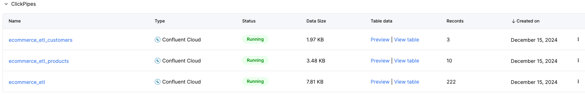

## 2024-12-16

### Run [datagen](https://github.com/MaterializeInc/datagen) locally using pre-built [Docker container image](https://hub.docker.com/r/materialize/datagen/tags)

```bash
docker pull materialize/datagen
```

- Produce the bootstrapped `products`, `customers` and `orders` records
```bash
docker run \
  --rm -it \
  -v ${PWD}/.env:/app/.env \
  -v ${PWD}/datagen/ecommerce_bootstrapped_data.json:/app/ecommerce_bootstrapped_data.json \
      materialize/datagen -s ecommerce_bootstrapped_data.json -n 1
```

- Periodically (or on-demand), produce new `orders` records
```bash
docker run \
  --rm -it \
  -v ${PWD}/.env:/app/.env \
  -v ${PWD}/datagen/ecommerce_orders.json:/app/ecommerce_orders.json \
      materialize/datagen -s ecommerce_orders.json -n 50
```

### Deploy to AWS
- Deployed the pre-built [Docker container image](https://hub.docker.com/r/materialize/datagen/tags) to ECR
  ```bash
  docker tag materialize/datagen:latest ${CONTAINER_REGISTRY_URL}/materialize/datagen:latest

  docker push ${CONTAINER_REGISTRY_URL}/materialize/datagen:latest
  ```
  


- Stored credentials as an `.env` file in S3

  


- Configured IAM role to read from above S3 bucket and `.env` file

  


- Provisioned an ECS cluster and task definition with the ECR ARN, path to `.env` file in S3 and IAM role
  
  

- Started an ECS task - however it failed to start with `exec: \"datagen\": executable file not found in $PATH: unknown` error
  
  


---

## 2024-12-15

### Preset visualization with streaming updates

- Configured Preset database connection to point to ClickHouse


- Created a Preset dataset to reference the `orders` table in ClickHouse. Created 2 custom metrics


- Created a Preset dashboard and 3 charts to show
  - total revenue sliced by `product_id` over time (monthly grain)
  - total revenue per `customer_id`
  - total quantity of products purchased per `customer_id`
    

- Ran `datagen` to produce 500 more recent orders to Kafka in Confluent Cloud. Refreshed the Preset visualization to show the updated data from ClickHouse streaming ingestion from Confluent Cloud.
  - Before
    
  - After
    

    

### ClickHouse

```sql
CREATE TABLE orders (
    id String,
    product_id UInt64,
    customer_id UInt64,
    quantity UInt64,
    total_price Float64,
    created_at DateTime
) ENGINE = MergeTree ORDER BY (product_id, customer_id, created_at)

CREATE TABLE products (
    id UInt64,
    title String,
    category String,
    vendor String,
    price Float64,
    description String,
    color String,
    size String,
    material String
) ENGINE = MergeTree ORDER BY (id)

CREATE TABLE customers (
    id UInt64,
    name String,
    email String,
    address String,
    city String,
    state String,
    zipcode String
) ENGINE = MergeTree ORDER BY (id)
```


- Query for the product categories that generated the most revenue
```sql
select
    products.category,
    SUM(orders.quantity) as total_quantity,
    SUM(orders.total_price) as total_revenue
from orders
join products
on orders.product_id = products.id
GROUP BY products.category
ORDER BY total_revenue DESC
```


- Query for the customers that spent the most
```sql
select
    customers.name,
    SUM(orders.quantity) as total_quantity,
    SUM(orders.total_price) as total_revenue
from orders
join customers
on orders.customer_id = customers.id
GROUP BY customers.name
ORDER BY total_revenue DESC
```


---

### Create a ksqlDB cluster and query data from Kafka topics
```sql
CREATE OR REPLACE STREAM orders_stream(
    id STRING,
    product_id INTEGER,
    customer_id INTEGER,
    quantity INTEGER,
    total_price STRING,
    created_at STRING
) WITH (
    KAFKA_TOPIC = 'orders',
    VALUE_FORMAT = 'JSON'
);

CREATE OR REPLACE STREAM products_stream(
    id INTEGER,
    title STRING,
    category STRING,
    vendor STRING,
    price STRING,
    description STRING,
    color STRING,
    `SIZE` STRING,
    material STRING
) WITH (
    KAFKA_TOPIC = 'products',
    VALUE_FORMAT = 'JSON'
);

CREATE OR REPLACE STREAM customers_stream(
    id INTEGER,
    name STRING,
    email STRING,
    address STRING,
    city STRING,
    state STRING,
    zipcode STRING
) WITH (
    KAFKA_TOPIC = 'customers',
    VALUE_FORMAT = 'JSON'
);
```

- get the total revenue from all orders in the past 30 minutes, grouped by product
```sql
SELECT
    product_id,
    SUM(CAST(total_price AS DOUBLE)) as total_price
FROM ORDERS_STREAM
WINDOW tumbling (SIZE 30 MINUTES)
GROUP BY product_id
EMIT CHANGES;
```


- get the total product quantity and revenue from all orders, grouped by product category, within the last 24 hours
```sql
CREATE STREAM orders_enriched AS
  SELECT
    products.category,
    SUM(orders.quantity) as total_quantity_per_category,
    SUM(CAST(orders.total_price AS DOUBLE)) as total_revenue_per_category
  FROM ORDERS_STREAM as orders
  INNER JOIN PRODUCTS_STREAM as products
    WITHIN 24 HOUR
    ON orders.product_id = products.id
  GROUP BY products.category
  EMIT CHANGES;
```


---

### Generate fake (but realistic-looking) data to stream into Kafka

- I chose not to use Confluent datagen as the [Avro schema examples](https://github.com/confluentinc/kafka-connect-datagen/tree/master/src/main/resources) look quite restrictive (e.g. limited to Regex parsing, and a pre-defined list of `options`) and do not produce realistic-looking data
- Instead, I chose to use [datagen](https://github.com/MaterializeInc/datagen) which leverages on the [faker.js](https://fakerjs.dev/) library

- Download and install [datagen](https://github.com/MaterializeInc/datagen)
```bash
git clone https://github.com/MaterializeInc/datagen.git
cd datagen
npm install
npm run build
npm link

# add to /.bash_profile
export PATH=$PATH:/usr/local/Cellar/node/23.3.0/bin
source ~/.bash_profile # or your equivalent .bash_config file
```

- Verify the installation
```bash
datagen -h
```

- Define products, customers and orders schema in `datagen/ecommerce_data_generator.json`. The default configuration will generate
  - 10 products
  - 3 customers
  - 5 orders per product with randomly-assigned `customer_id`
  - 4 orders per customer with randomy-assigned `product_id`

- Perform a dry run to inspect the fake data that will be generated
```bash
datagen \
    --schema datagen/ecommerce_bootstrapped_data.json \
    --format json \
    --number 1 \
    --dry-run \
    --debug
```

- Create a Kafka cluster in Confluent Cloud and generate an API key.
- Clone `.env.example` into `.env` and fill in the Kafka cluster credentials
- Run the `datagen` generator to produce bootstrapped data into Kafka cluster
  - You only need to do this once to seed the initial set of products and customers
```bash
datagen \
    --schema datagen/ecommerce_bootstrapped_data.json \
    --format json \
    --number 1
```

- Subsequently, to generate more orders, run the `datagen` generator on the orders template. This can be run at a periodic interval
```bash
datagen \
    --schema datagen/ecommerce_orders.json \
    --format json \
    --number 50
```


