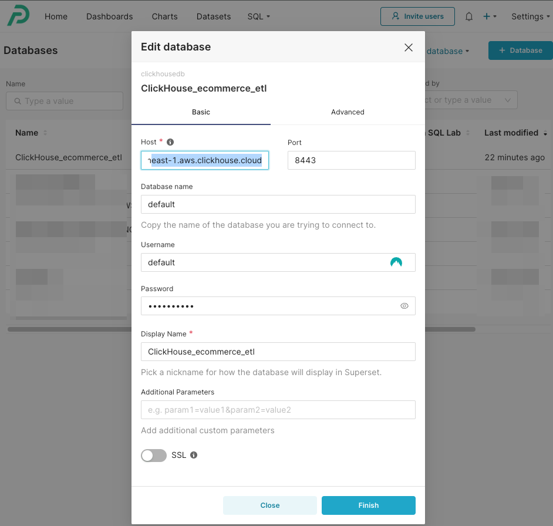
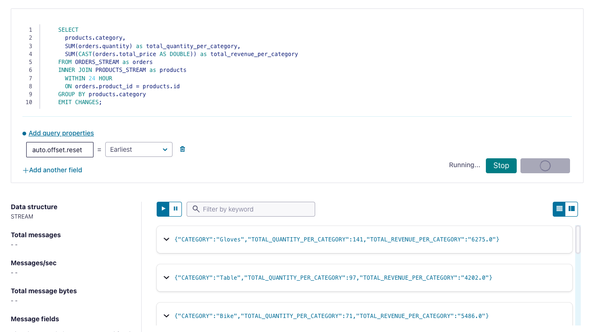
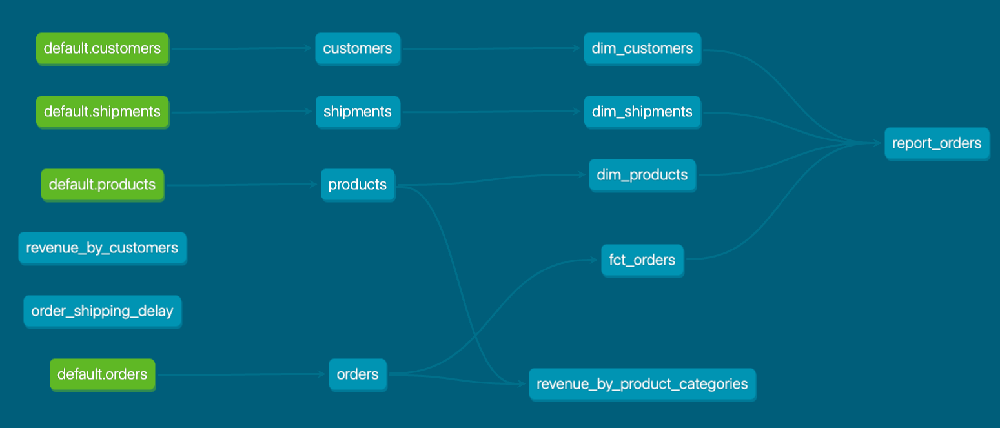

## An e-commerce streaming analytics Demo

### Introduction
This was my Capstone Project for the [Data Engineering Bootcamp](https://dataengineercamp.com/), to create a streaming ELT pipeline using Kafka, Confluent Cloud, ClickHouse, dbt and Preset.

It demonstrates designing streaming data pipelines and an analytical data warehouse for an e-commerce store.
- data sources: `Product`, `Order` and `Customer` correspond to simulated records from operational databases from an e-commerce store
  - source data is generated using [datagen](https://github.com/MaterializeInc/datagen) (which leverages on the [faker.js](https://fakerjs.dev/) library) and streamed into a Kafka cluster on Confluent Cloud
- stream processing using ksqldb
- raw data is also streamed into ClickHouse Cloud
- dimensional data modeling using dbt: (i) fact and dimension tables, (ii) one-big-table to provide the semantic layer for BI dashboards, data exploration and report generation
- visualization using Preset
- CI/CD using GitHub Actions

### Business Objectives

Business process modeling
- We model the e-commerce orders creation business process to ingest, process and visualize real-time orders and total revenue over time, segmented by
  - products and categories
  - customers

What users would find your dataset useful?
  - for the Finance and Operations departments, provide a sales report of the orders over time. Provide the ability to slice by product name, product category and product supplier.
  - for the Operations department, provide a report of the shipping delay from order creation to shipping completion.
  - for the Marketing department, provide a report of the customers who generated the most revenue to create marketing campaigns and loyalty programmes.
  - for the Analytics department, provide raw and modelled data to build machine learning models to provide recommendations to customers to maximise total lifetime value.

### Solution Architecture


### 1. Setting up Confluent Cloud

- [Sign up](https://confluent.cloud/signup) for a free Confluent trial
- Create a Kafka cluster in Confluent Cloud and generate an API key
- Create topics `products`, `orders`, `customers`, `shipments`, and `shops`
- Clone `.env.example` into `.env` and fill in the Kafka cluster credentials
  ```bash
  source .env
  ```

### 2. Data generation from local machine

- Run [datagen](https://github.com/MaterializeInc/datagen) locally using pre-built [Docker container image](https://hub.docker.com/r/materialize/datagen/tags)
  ```bash
  docker pull materialize/datagen
  ```

- Produce the bootstrapped `products` and `customers` records (100 products and 50 customers)
  ```bash
  docker run \
    --rm -it \
    -v ${PWD}/.env:/app/.env \
    -v ${PWD}/datagen/ecommerce_bootstrap_shops_and_customers.json:/app/ecommerce_bootstrap_shops_and_customers.json \
        materialize/datagen -s ecommerce_bootstrap_shops_and_customers.json -n 1
  ```

- Verify that new records are generated in the respective topics in the Kafka cluster in Confluent Cloud

- Whenever needed, you can generate a random number of new `orders` records and produce to Kafka
  ```bash
  num_orders=$((1 + RANDOM % 100))

  docker run \
    --rm -it \
    -v ${PWD}/.env:/app/.env \
    -v ${PWD}/datagen/ecommerce_orders_recent.json:/app/ecommerce_orders_recent.json \
        materialize/datagen -s ecommerce_orders_recent.json -n ${num_orders}
  ```

### 3. Data generation from Cloud instance (EC2 instance in AWS)

- An initial attempt was made to upload the pre-built [Docker container image](https://hub.docker.com/r/materialize/datagen/tags) to ECR, in order to run the container in an ECS task.
  - However this was not successful. Instead, I logged into the EC2 instance backing the ECS cluster to perform the following steps.
  - These steps should also work if you provision an EC2 instance from scratch
    - The AMI should be an Amazon Linux 2 AMI, with kernel 5.10 and ARM architecture
    - a `t4-micro` instance on the free-tier should suffice

- Copy the following files into the EC2 instance in the `$HOME` directory
  - `.env` file
  - `datagen/ecommerce_bootstrap_shops_and_customers.json`
  - `datagen/ecommerce_orders_recent.json`

- Pull the container image from Dockerhub
  ```bash
  docker pull materialize/datagen
  ```

- verify that the Docker container can be used to produce data to Confluent Cloud (similar to how it was done on local machine)
  ```bash
  docker run \
  -v ${PWD}/.env:/app/.env \
  -v ${PWD}/ecommerce_bootstrap_shops_and_customers.json:/app/ecommerce_bootstrap_shops_and_customers.json \
      materialize/datagen -s ecommerce_bootstrap_shops_and_customers.json -n 1

  docker run \
  -v ${HOME}/.env:/app/.env \
  -v ${HOME}/ecommerce_orders_recent.json:/app/ecommerce_orders_recent.json \
      materialize/datagen -s ecommerce_orders_recent.json -n 50
  ```

- To automate this data generation, create a Shell script and schedule it to produce data periodically
  - Create the script: `vi stream_produce.sh` and paste the following:
    ```bash
    now="$(date +"%T")"
    echo "Current Time: $now"
    echo "Running 'datagen ecommerce_orders_recent.json'"

    #!/usr/bin/env bash

    num_orders=$((1 + RANDOM % 20))

    docker run \
      -v ${HOME}/.env:/app/.env \
      -v ${HOME}/ecommerce_orders_recent.json:/app/ecommerce_orders_recent.json \
          materialize/datagen -s ecommerce_orders_recent.json -n ${num_orders}

    echo "All done"
    ```

  - Execute the shell script to verify that it works
    ```bash
    sh stream_produce.sh
    ```

  - Set up crontab to run this shell script every 2 minutes (or some other internal you prefer)
    ```bash
    crontab -e
    */2 * * * * sh $HOME/stream_produce.sh >> $HOME/cron.log
    ```

  - Verify that the Kafka cluster sees new orders produced every 2 minutes

  - The above steps effectively simulate a periodic ECS task that runs a Docker container to produce to Confluent Cloud, or a Confluent `Datagen Source` connector, but with more customizable and realistic-looking data.

### 4. Streaming data into ClickHouse via Kafka connector

- [Sign up](https://clickhouse.com/) for a ClickHouse trial.
- Create a ClickHouse database `ecommerce_etl_dev`
  ```bash
  CREATE DATABASE ecommerce_etl_dev
  ```
- Create the following tables - the queries to create these are in the `warehouse/clickhouse/table-definitions` folder:
  - `products`
  - `customers`
  - `orders`
  - `shipments`
- For each of the above tables, create a Clickpipe using the Kafka cluster credentials and bootstrap server URL in the Confluent Cloud UI
  
  - Note: the `shipments`, `shipment_dispatches` and `shipment_completions` topics in Kafka can all be mapped to the `shipments` table in ClickHouse, as these follow the same schema and are meant for accumulating fact tables.
- After the data in Kafka has been populated, you can run some example queries in the `warehouse/clickhouse/queries` folder
  - These queries will also be materialized via dbt as `intermediate` models in a later section

### 5. Installing and running dbt

- This project has been configured to run dbt via Github Actions, in the `.github/workflows` directory
  - `dbt-test.yml` will run models and tests against a `dev` database in ClickHouse
  - `dbt-run-on-merge.yml` will run models against a `prod` database in ClickHouse with much larger data volume

- However, for local development and testing, you can also build and run dbt models against a `dev` database in ClickHouse

```bash
# NOTE: This project has only been tested against Python 3.10.
# Python 3.12 will likely not work, due to library dependencies. Your mileage may vary.
conda create -n "python3_10" python=3.10

python -m pip install -r transform/dbt/requirements.txt 

dbt run --project-dir transform/dbt/ecommerce_etl --profiles-dir transform/dbt/ecommerce_etl

dbt test --project-dir transform/dbt/ecommerce_etl --profiles-dir transform/dbt/ecommerce_etl

sqlfluff lint transform/dbt/ecommerce_etl
```

- You can subsequent verify the `mart` data models via ClickHouse queries, e.g.
  ```sql
  SELECT * FROM "report_orders" LIMIT 10
  ```

- After the dbt models have been verified in the `default` database, proceed to
  - create the corresponding tables in a `prod` database in ClickHouse
  - create the corresponding Clickpipes to set up data streaming from the respective topics in Kafka.

### 6. Setting up Preset for data visualization

- [Sign up](https://preset.io/) for a Preset trial
- Over in ClickHouse, obtain the connection credentials to your target database and configure a new Preset database connection to point to ClickHouse

  
- Create a dataset for the `report_orders` table (one big table) which serves as the semantic layer to explore the various facts and dimensions of the `orders` model
- Create a Preset dashboard and some charts to generate reports. Example charts:
  - total revenue sliced by `product_id` over time (monthly grain)
  - total revenue per `customer_id`
  - total quantity of products purchased per `customer_id`

- Preset visualization of ClickHouse data can be configured to be automatically refreshed with new streaming data and dimensionally-modelled data

  

### Selected Screenshots
(more details in [CHANGELOG.md](CHANGELOG.md))

Stream Ingestion and Processing
- Stream ingestion of `orders` into Kafka cluster in Confluent Cloud

  

- Stream-to-stream join queries using ksqldb with a 24-hour window

  

- Lineage of dimensionally-modelled data

  

- Star-schema Entity-Relationship Diagram

  

CI/CD:
- On creating/updating a pull request to `main`, run `sqlfluff` linter and `dbt test` pointing to `dev` ClickHouse tables

  

- On merge to `main`, run `dbt run --target prod` to update `prod` ClickHouse tables

  
